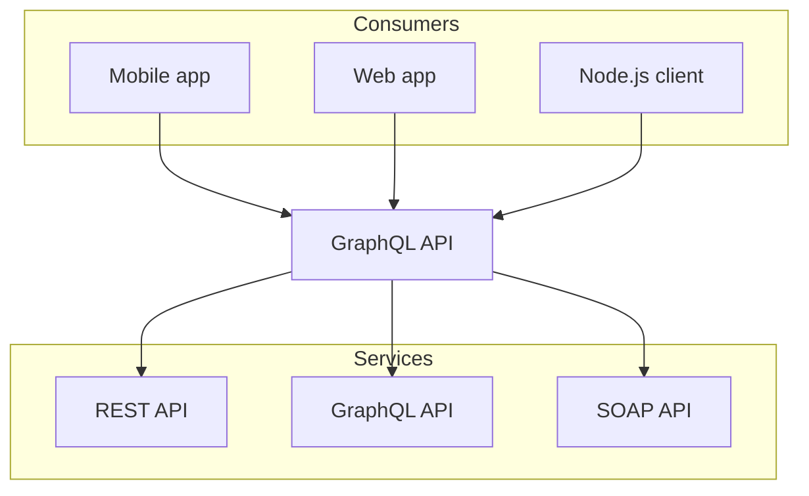

# Markdown

## Strikethrough

~~removed~~

## Task List

- [x] Task 1
- [ ] Task 2
- [ ] Task 3

## Table

| Name | Age | Sex |
| ---- | --- | --- |
| Bob  | 18  | M   |
| Tom  | 20  | M   |
| Lily | 19  | F   |

## Autolinks

Visit https://nextjs.org.

## Custom Heading Id

## Long heading about Nextra [#about-nextra]

# Syntax Highlighting

## Simple use

```js copy showLineNumbers filename="example.js"
console.log("hello, world");
```

## Inlined Code

Inlined syntax highlighting is also supported `let x = 1{:jsx}` via:

## Highlighting Lines

```js {1,4-5}
import { useState } from "react";

function Counter() {
  const [count, setCount] = useState(0);
  return <button onClick={() => setCount(count + 1)}>{count}</button>;
}
```

## Highlighting Substrings

```js /useState/
import { useState } from "react";

function Counter() {
  const [count, setCount] = useState(0);
  return <button onClick={() => setCount(count + 1)}>{count}</button>;
}
```

## ANSI Highlighting

```ansi
 ✓ src/index.test.ts (1)
   Test Files  1 passed (1)
        Tests  1 passed (1)
     Start at  23:32:41
     Duration  11ms
   PASS  Waiting for file changes...
         press h to show help, press q to quit
```

# Advanced

## Npm2Yarn

```sh npm2yarn
npm i -D @graphql-eslint/eslint-plugin
```

## Mermaid



## Dynamic Tables

<table>
  <thead>
    <tr>
      <th>Country</th>
      <th>Flag</th>
    </tr>
  </thead>
  <tbody>
    {[
      { country: "France", flag: "🇫🇷" },
      { country: "Ukraine", flag: "🇺🇦" },
    ].map((item) => (
      <tr key={item.country}>
        <td>{item.country}</td>
        <td>{item.flag}</td>
      </tr>
    ))}
  </tbody>
</table>

# NextJS & React Components

## Next.js Link

Click [here](/about) to read more.

## Callout Component

import { Callout } from "nextra/components";

<Callout emoji="👾">
  **Space Invaders** is a 1978 shoot 'em up arcade game developed by Tomohiro
  Nishikado.
</Callout>

<Callout type="info" emoji="ℹ️">
  Today is Friday.
</Callout>

<Callout type="warning" emoji="⚠️">
  This API will be deprecated soon.
</Callout>

<Callout type="error" emoji="️🚫">
  This is a dangerous feature that can cause everything to explode.
</Callout>

## Tabs Component

import { Tabs, Tab } from "nextra/components";

<Tabs items={["pnpm", "npm", "yarn"]}>
  <Tab>**pnpm**: Fast, disk space efficient package manager.</Tab>
  <Tab>
    **npm** is a package manager for the JavaScript programming language.
  </Tab>
  <Tab>**Yarn** is a software packaging system.</Tab>
</Tabs>

## Cards Component

import { Cards, Card } from "nextra/components";

<Cards>
  <Card icon={<span />} title="Callout" href="/docs/guide/built-ins/callout" />
  <Card icon={<span />} title="Tabs" href="/docs/guide/built-ins/tabs" />
  <Card icon={<span />} title="Steps" href="/docs/guide/built-ins/steps" />
</Cards>

## Steps Component

import { Steps } from "nextra/components";

<Steps>
  ### Step 1

Contents for step 1.

### Step 2

Contents for step 2.

</Steps>

## File Tree Component

import { FileTree } from "nextra/components";

<FileTree>
  <FileTree.Folder name="pages" defaultOpen>
    <FileTree.File name="_meta.json" />
    <FileTree.File name="contact.md" />
    <FileTree.File name="index.mdx" />
    <FileTree.Folder name="about">
      <FileTree.File name="_meta.json" />
      <FileTree.File name="legal.md" />
      <FileTree.File name="index.mdx" />
    </FileTree.Folder>
  </FileTree.Folder>
</FileTree>
